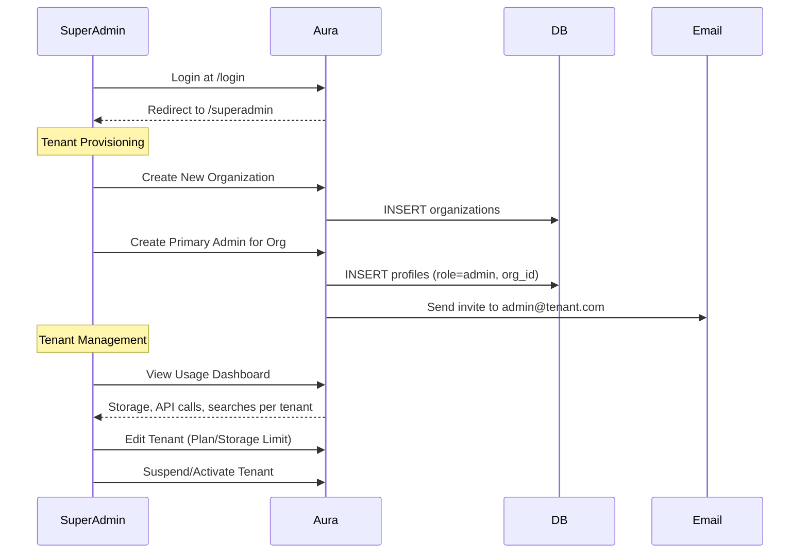
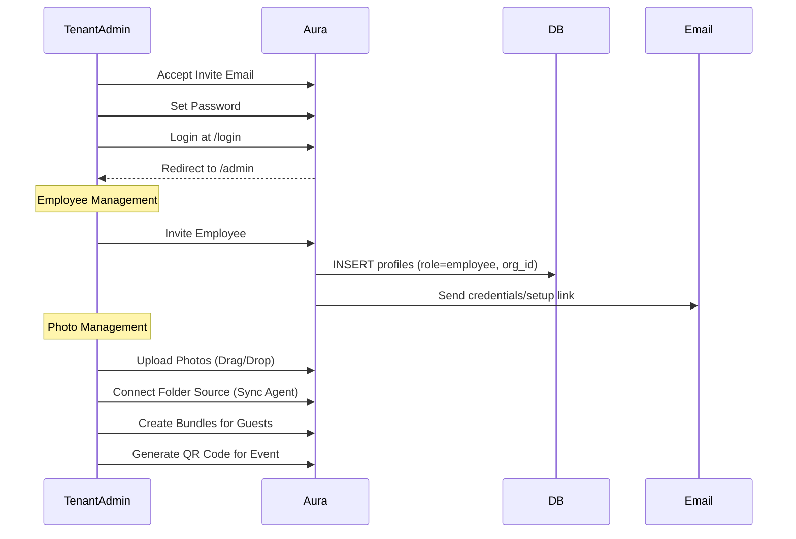

# Client Project Plan: "Aura Pro"

**Vision**: A Multi-Tenant SaaS Platform for Photo Studios  
**Target Release**: 2026  
**Stack**: Next.js 15, FastAPI, Supabase (PostgreSQL + pgvector), WebUSB

---

## 🏗 Architecture Overview

### System Architecture


The Aura Pro platform follows a multi-tenant architecture where all users authenticate through a unified login on the landing page. Based on their role stored in the `profiles` table, users are redirected to their respective portals:

- **SuperAdmin Portal** (`/superadmin`): Platform operators (us) manage all tenants, monitor usage metrics, set billing limits, and control system health.
- **Studio Admin** (`/admin`): Tenant administrators manage their studio's photos, employees, sources, and bundles. All queries are scoped to their `org_id`.
- **Photographer Station** (`/capture`): Employees upload photos, create bundles, and view assigned events. Limited permissions (no delete/settings access).
- **Guest Scan** (`/scan`): Event attendees find their photos via face recognition. No account required.

### User Roles & Permissions

| Role | Portal | Capabilities |
|------|--------|--------------|
| **SuperAdmin** | `/superadmin` | Full platform access: Manage tenants, view all usage metrics, set billing limits, system health monitoring, audit logs |
| **Admin** | `/admin` | Studio management: Employees, sources, photos, bundles, settings. Can invite employees and manage storage |
| **Employee** | `/capture` | Upload photos, create bundles, view assigned events. Cannot delete photos or access settings |
| **Guest** | `/scan` | Face-scan to find their photos in a specific event. No account required, session-based |

### Storage Architecture (Ethiopia-Optimized)


Designed for Ethiopian market conditions where internet connectivity can be unreliable and expensive, the hybrid storage architecture supports multiple workflows:

1. **Event Photography (Mobile)**: Photographers at events upload directly to "Event Temp Storage" using mobile data. Photos are marked as temporary and can be reviewed/archived later at the studio.

2. **Studio Workflow (Local Primary)**: Studios register local folders (e.g., `D:\Photos\2026`) as sources. The Sync Agent monitors these folders and performs:
   - **Offline Queue**: Actions queued in IndexedDB when offline
   - **Delta Sync**: Only changed files synced, reducing bandwidth
   - **Bandwidth Limit**: Configurable upload speed to avoid saturating connection
   - **Local Search**: Vector index maintained locally for offline face search

3. **Hybrid Search**: API can search both cloud and local sources, with results merged and deduplicated.

### Database Schema

```sql
-- Core Multi-Tenant Tables
organizations (id, name, slug, plan, storage_limit_gb, storage_used_bytes, is_active, created_at)
profiles      (id → auth.users, email, display_name, role, org_id → organizations, created_at)
photos        (id, path, full_path, embedding, org_id, source_type, photo_date, metadata, created_at)
bundles       (id, name, photo_ids[], org_id, created_by, created_at)
usage_logs    (id, org_id, user_id, action, bytes_processed, metadata, created_at)

-- Key Constraints
• profiles.role IN ('superadmin', 'admin', 'employee')
• photos.source_type IN ('cloud', 'local_sync', 'event_temp')
• organizations.plan IN ('free', 'pro', 'enterprise')
```

### RLS Policy Summary

| Table | SuperAdmin | Admin | Employee |
|-------|------------|-------|----------|
| organizations | ALL | SELECT own | SELECT own |
| profiles | ALL | SELECT org | SELECT org |
| photos | ALL | ALL org | SELECT/INSERT org |
| bundles | ALL | ALL org | SELECT/INSERT org |
| usage_logs | ALL | SELECT org | - |

### Authentication Flow

1. User visits `/` (Landing Page)
2. Enters credentials (PIN for MVP, email/password planned)
3. Backend validates credentials and fetches profile from `profiles` table
4. JWT token generated with claims: `{role, org_id, org_slug, exp}`
5. Response includes `redirect` path based on role
6. Frontend stores token in sessionStorage and navigates to appropriate portal

---

## 📅 Implementation Phases

### Phase 1: Foundation Upgrade (Backend) [DONE]

**Goal**: Migrate from ephemeral local CSV/LanceDB to cloud-native Supabase.

- [x] **Setup Supabase**: Initialize project, enable `pgvector` extension for vector similarity search
- [x] **Schema Design**: Create tables for `users`, `photos`, `bundles`, `embeddings` with proper indexes
- [x] **Migrate Logic**: Rewrite `database.py` to use Supabase client instead of local LanceDB
- [x] **Authentication API**: Implement `POST /auth/face-login` for face-based authentication

> **Tech Details**: Using `pgvector` with HNSW index for sub-100ms similarity search on 100k+ embeddings.

### Phase 2: Core UX & "No Cable" Sync [FRONTEND] [DONE]

**Goal**: Build the Admin Capture Station with direct camera connection.

- [x] **WebUSB Integration**: Implement `tethr` library for PTP protocol camera communication
- [x] **Sync Pipeline**: Camera → Browser (Blob) → Supabase Storage with progress tracking
- [x] **Dexie Cache**: Local IndexedDB caching for instant thumbnail preview

> **Tech Details**: WebUSB requires HTTPS. Camera detection via `navigator.usb.requestDevice()`.

### Phase 3: Public Face [FRONTEND] [DONE]

**Goal**: Professional landing page and seamless guest experience.

- [x] **Landing Page**: Editorial design with bold typography, professional photography focus
- [x] **Gallery 2.0**: Virtualized grid using TanStack Virtual for 10,000+ photos
- [x] **QR Generation**: Admin can generate unique event QR codes for guests

> **Design**: Bold typography, clean borders, no glassmorphism - professional editorial style.

### Phase 4: Intelligence & Delivery [CORE] [DONE]

**Goal**: Advanced face search and efficient download management.

- [x] **Backend Search**: `match_faces` RPC function using cosine similarity with configurable threshold
- [x] **Download Manager**: Client-side zip generation using `jszip` to reduce server load

> **Performance**: HNSW index enables ~50ms search across 100k embeddings.

### Phase 5: Multi-Tenant Platform [IN PROGRESS]

**Goal**: Role-based access control and SuperAdmin management portal.

#### 5A: Database Foundation [DONE]
- [x] **Organizations Table**: Tenants with plan limits and storage tracking
- [x] **Profiles Table**: Users with roles (superadmin/admin/employee)
- [x] **RLS Policies**: Strict tenant isolation via `org_id` filtering
- [x] **Role-Based JWT**: Login returns token with role, org_id, org_slug claims
- [x] **SuperAdmin Portal**: `/superadmin` route with tenant CRUD and stats dashboard

#### 5B: SuperAdmin Portal Enhancements [PARTIAL]
- [x] **Usage Dashboard**: Activity feed implemented, chart visualizations pending
- [ ] **Billing Management**: Upgrade plans, set custom limits, overage alerts
- [ ] **Audit Logging**: Track all superadmin actions with timestamps
- [ ] **Tenant Onboarding**: Email workflow for new tenant invites

#### 5C: Tenant Admin Scoping [DONE]
- [x] **Scoped Queries**: All `/admin` queries filtered by `org_id` from JWT
- [x] **Employee Management**: /admin/team page with invite modal, role assignment, member removal
- [x] **Usage Tracking**: Middleware implemented in main.py (log_usage, update_storage_stats)

### Phase 6: Hybrid Storage [PLANNED]

**Goal**: Local + Cloud sources optimized for Ethiopian market conditions.

#### 6A: Cloud Enhancements [TODO]
- [x] **Source Types**: `source_type` column verified in schema
- [x] **Sources UI**: /admin/sources page with type visualization
- [ ] **Event Temp Tier**: Auto-cleanup after 30 days, convert to permanent on approval

#### 6B: Sync Agent (Desktop App) [TODO]
- [ ] **Desktop App**: Electron/Tauri application for Windows/Mac
- [ ] **Folder Watch**: Monitor registered local directories for changes
- [ ] **Offline Queue**: IndexedDB-based queue for actions during offline periods
- [ ] **Delta Sync**: Only sync file changes, not full files
- [ ] **Bandwidth Throttle**: Configurable upload speed limit (KB/s)
- [ ] **Local Vector Index**: Face embeddings stored locally for offline search
- [ ] **Conflict Resolution**: Last-write-wins with manual override option

---

## 🛡 Security & Compliance

| Concern | Solution |
|---------|----------|
| **Tenant Data Isolation** | RLS policies with `org_id` on all queries, tested extensively |
| **SuperAdmin Abuse Prevention** | Audit logging for all superadmin actions with IP and timestamp |
| **Sync Agent Security** | Scoped API keys per tenant (not service_role), rotatable |
| **Rate Limiting** | Per-tenant quotas enforced at API level, configurable limits |
| **Guest Privacy** | Face embeddings computed client-side, never stored for guests |
| **Data at Rest** | Supabase encryption, optional customer-managed keys (enterprise) |

---

## 🔧 Tech Stack Summary

| Layer | Technology | Notes |
|-------|------------|-------|
| **Frontend** | Next.js 15, React 18 | App Router, Server Components |
| **Styling** | Vanilla CSS | Editorial design system |
| **Backend** | FastAPI (Python 3.11) | Async, auto-docs with OpenAPI |
| **ML** | InsightFace | 512-dim embeddings, ~50ms/face |
| **Database** | Supabase PostgreSQL + pgvector | RLS, realtime, edge functions |
| **Storage** | Supabase Storage | S3-compatible, CDN, signed URLs |
| **Auth** | Supabase Auth + Custom JWT | Role-based, org-scoped |
| **Desktop** | Electron/Tauri | Phase 6 - Sync Agent |
| **Deployment** | Vercel + Cloud Run | Frontend + Backend |
---

## 🔐 Phase 5.5: User & Access Management Workflows [NEW]

> **Goal**: Define detailed end-to-end workflows for platform governance, user management, and access control.

### SuperAdmin Workflow



**SuperAdmin Capabilities**:
| Action | Endpoint | Notes |
|--------|----------|-------|
| Create Organization | `/superadmin` → Create Tenant | Sets slug, initial plan, storage limit |
| Create Primary Admin | `/superadmin` → Add Admin | Links to organization, triggers invite |
| Edit Tenant Config | `/superadmin` → Edit Modal | Plan upgrade, storage limit change |
| Suspend/Activate | `/superadmin` → Toggle | Revokes/grants all org access |
| View Platform Stats | `/superadmin` Dashboard | Total tenants, photos, storage |
| View Activity Feed | `/superadmin` Sidebar | Real-time usage logs |

### Tenant Admin Workflow



**Tenant Admin Capabilities**:
| Action | Location | Notes |
|--------|----------|-------|
| Invite Employee | `/admin/team` (Planned) | Email with setup link |
| Assign Role | `/admin/team` (Planned) | employee/photographer |
| Remove Employee | `/admin/team` (Planned) | Revokes access, retains data |
| Connect Folder | `/admin/sources` (Planned) | Via Sync Agent |
| Revoke Folder | `/admin/sources` (Planned) | Stops sync, optionally delete cloud copy |
| View Usage | `/admin` Dashboard | Storage, uploads, searches |

### Employee Workflow

1. **Receive Credentials**: Admin sends email with login info
2. **Login**: Access `/login` with provided credentials
3. **Capture Photos**: Access `/admin/capture` for camera connection
4. **Upload Photos**: Drag-and-drop to org folder
5. **Search**: Limited to org photos only (RLS enforced)

---

## 📂 Server Folder & Storage Architecture [NEW]

> **Goal**: Define the storage structure on the cloud server for optimal organization, sync compatibility, and future scalability.

### Cloud Storage Path Convention

```
supabase-storage/
└── photos/
    └── {org_slug}/
        └── {year}/
            └── {event_or_folder_name}/
                ├── originals/
                │   └── IMG_0001.jpg
                └── optimized/
                    ├── full/        (2000px max dimension)
                    │   └── IMG_0001.webp
                    └── thumbs/      (400px max dimension)
                        └── IMG_0001.webp
```

### Path Breakdown

| Segment             | Purpose                 | Example          |
| ------------------- | ----------------------- | ---------------- |
| `{org_slug}`        | Tenant isolation        | `studio-abc`     |
| `{year}`            | Time-based partitioning | `2026`           |
| `{event_or_folder}` | Logical grouping        | `wedding-jan-15` |
| `originals/`        | RAW/Original uploads    | Full-res JPG/RAW |
| `optimized/full/`   | Web-optimized           | 2000px WebP      |
| `optimized/thumbs/` | Thumbnails              | 400px WebP       |

### Benefits

1. **Sync Compatibility**: Mirrors local folder structure for easy sync agent mapping
2. **Tenant Isolation**: `org_slug` as root prevents cross-tenant access
3. **Performance**: Pre-generated thumbnails for instant gallery loading
4. **Future-Proof**: Structured for CDN integration, lifecycle policies, tiered storage

---

## 🔄 Phase 6: Enhanced Bidirectional Sync Specification [UPDATED]

> **Goal**: Bidirectional sync between local studio servers and cloud, with robust conflict handling and data safety.

### 6A: Cloud Storage Enhancements [UPDATED]

- [ ] **Source Types**: `source_type` column already in schema (cloud/local_sync/event_temp)
- [ ] **Sources Management UI**: `/admin/sources` for registering local folders
- [ ] **Event Temp Auto-Cleanup**: 30-day TTL with admin approval for permanence
- [ ] **Optimized Image Pipeline**: Auto-generate `full/` and `thumbs/` variants on upload

### 6B: Bidirectional Sync Agent [NEW SPECIFICATION]

#### Core Features

| Feature                | Description                               |
| ---------------------- | ----------------------------------------- |
| **Upload Sync**        | Local changes → Cloud (existing behavior) |
| **Download Sync**      | Cloud changes → Local (NEW)               |
| **Folder Sync Toggle** | Per-folder setting: "Always sync latest"  |
| **Selective Sync**     | Choose specific folders to sync (not all) |
| **Conflict Detection** | Hash comparison before overwrite          |

#### Sync Modes

1. **Upload-Only Mode** (Default)
   - Local folder → Cloud
   - Ideal for event photographers uploading to studio
2. **Download-Only Mode**
   - Cloud → Local folder
   - Ideal for backup to local NAS
3. **Bidirectional Mode** (Full Sync)
   - Changes in either direction synced
   - Requires conflict resolution strategy

#### Deletion Handling (CRITICAL)

```mermaid
graph TD
    A[File Deleted] --> B{Deletion Source?}
    B -->|Local| C[Move to Cloud Trash]
    B -->|Cloud| D[Move to Local Trash]
    C --> E[Retain 30 days in Trash]
    D --> E
    E --> F{User Action?}m
    F -->|Restore| G[Move back to original location]
    F -->|Permanent Delete| H[Hard delete from both locations]
    F -->|30 days elapsed| H
```

**Deletion Rules**:
| Scenario | Action | Reversible |
|----------|--------|------------|
| Local delete | Cloud copy moved to `.trash/` | Yes (30 days) |
| Cloud delete | Local copy moved to `.aura_trash/` | Yes (30 days) |
| Folder delete | Mark folder as "deleted", not immediate hard delete | Yes (admin restore) |
| Conflict on restore | Rename restored file with timestamp suffix | - |

#### Conflict Resolution

| Scenario                                | Strategy                            | User Action            |
| --------------------------------------- | ----------------------------------- | ---------------------- |
| Same file modified both sides           | Last-write-wins (configurable)      | Can choose "keep both" |
| New file added both sides (same name)   | Keep both with suffix               | -                      |
| File deleted locally, modified on cloud | Cloud version wins (saved to local) | Can restore local      |
| File modified locally, deleted on cloud | Local version wins (re-uploaded)    | Can confirm delete     |

#### Sync Agent Technical Spec

```yaml
# sync_config.yaml
sync_agent:
  version: "1.0.0"
  org_id: "uuid"
  api_key: "tenant_scoped_key" # Not service_role

  folders:
    - local_path: "D:\\Photos\\2026\\Weddings"
      cloud_path: "studio-abc/2026/weddings"
      mode: "bidirectional"
      sync_interval_minutes: 30

    - local_path: "D:\\Photos\\2026\\Events"
      cloud_path: "studio-abc/2026/events"
      mode: "upload-only"
      sync_interval_minutes: 60

  settings:
    bandwidth_limit_kbps: 5000
    trash_retention_days: 30
    conflict_strategy: "last-write-wins"
    optimize_on_upload: true
    sync_metadata: true
```

### 6C: Data Safety & Backup [NEW]

| Feature              | Implementation                                     |
| -------------------- | -------------------------------------------------- |
| **Trash Folder**     | Cloud: `{org_slug}/.trash/`, Local: `.aura_trash/` |
| **Retention Period** | 30 days default, configurable per tenant           |
| **Restore API**      | `POST /api/trash/restore/{id}`                     |
| **Permanent Delete** | Requires admin confirmation + audit log            |
| **Backup Export**    | Admin can export all org data as ZIP (planned)     |
