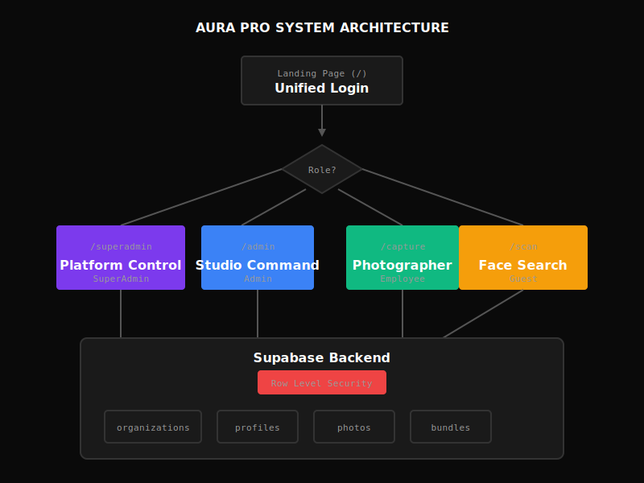
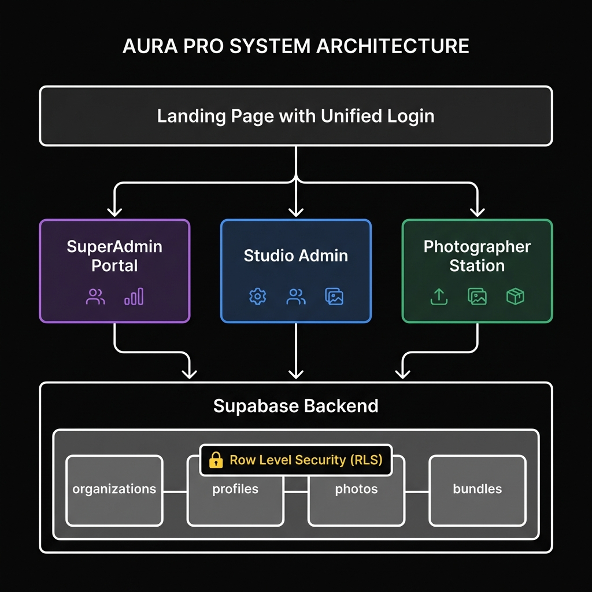
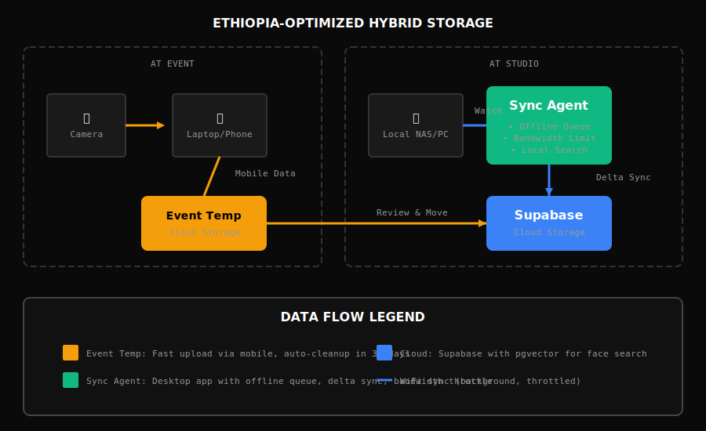
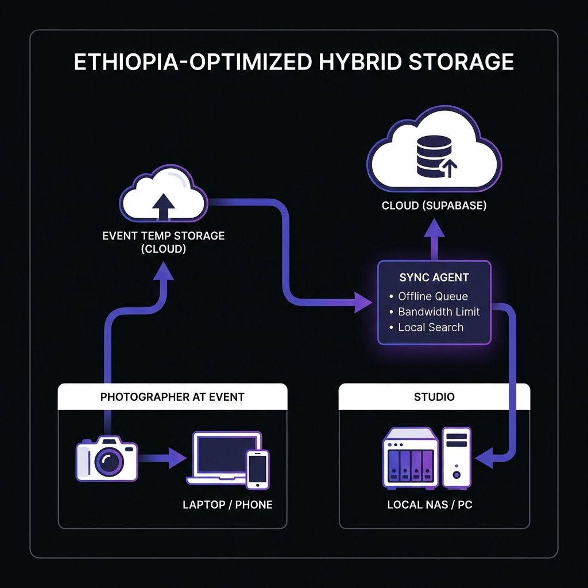

# Client Project Plan: "Aura Pro"

**Vision**: A Multi-Tenant SaaS Platform for Photo Studios
**Target Release**: 2026
**Stack**: Next.js 15, FastAPI, Supabase (PostgreSQL + pgvector), WebUSB
**Current Status**: MVP Production Ready (Authentication, Storage, Search, & Tethr functional)

---

## 🏗 Architecture Overview

### System Architecture




The Aura Pro platform follows a multi-tenant architecture where all users authenticate through a unified login on the landing page. Based on their role stored in the `profiles` table, users are redirected to their respective portals:

- **SuperAdmin Portal** (`/superadmin`): Platform operators (us) manage all tenants, monitor usage metrics, set billing limits, and control system health.
- **Studio Admin** (`/admin`): Tenant administrators manage their studio's photos, employees, sources, and bundles. All queries are scoped to their `org_id`.
- **Photographer Station** (`/capture`): Employees upload photos, create bundles, and view assigned events. Limited permissions (no delete/settings access).
- **Guest Scan** (`/scan`): Event attendees find their photos via face recognition. No account required.

### User Roles & Permissions

| Role           | Portal        | Capabilities                                                                                                           |
| -------------- | ------------- | ---------------------------------------------------------------------------------------------------------------------- |
| **SuperAdmin** | `/superadmin` | Full platform access: Manage tenants, view all usage metrics, set billing limits, system health monitoring, audit logs |
| **Admin**      | `/admin`      | Studio management: Employees, sources, photos, bundles, settings. Can invite employees and manage storage              |
| **Employee**   | `/capture`    | Upload photos, create bundles, view assigned events. Cannot delete photos or access settings                           |
| **Guest**      | `/scan`       | Face-scan to find their photos in a specific event. No account required, session-based                                 |

### Storage Architecture (Ethiopia-Optimized)




Designed for Ethiopian market conditions where internet connectivity can be unreliable and expensive, the hybrid storage architecture supports multiple workflows:

1. **Event Photography (Mobile)**: Photographers at events upload directly to "Event Temp Storage" using mobile data. Photos are marked as temporary and can be reviewed/archived later at the studio.

2. **Studio Workflow (Local Primary)**: Studios register local folders (e.g., `D:\Photos\2026`) as sources. The Sync Agent monitors these folders and performs:
   - **Offline Queue**: Actions queued in IndexedDB when offline
   - **Delta Sync**: Only changed files synced, reducing bandwidth
   - **Bandwidth Limit**: Configurable upload speed to avoid saturating connection
   - **Local Search**: Vector index maintained locally for offline face search

3. **Hybrid Search**: API can search both cloud and local sources, with results merged and deduplicated.

### Database Schema

```sql
-- Core Multi-Tenant Tables
organizations (id, name, slug, plan, storage_limit_gb, storage_used_bytes, is_active, created_at)
profiles      (id → auth.users, email, display_name, role, org_id → organizations, created_at)
photos        (id, path, full_path, embedding, org_id, source_type, photo_date, metadata, created_at)
bundles       (id, name, photo_ids[], org_id, created_by, created_at)
usage_logs    (id, org_id, user_id, action, bytes_processed, metadata, created_at)

-- Key Constraints
• profiles.role IN ('superadmin', 'admin', 'employee')
• photos.source_type IN ('cloud', 'local_sync', 'event_temp')
• organizations.plan IN ('free', 'pro', 'enterprise')
```

### RLS Policy Summary

| Table         | SuperAdmin | Admin      | Employee          |
| ------------- | ---------- | ---------- | ----------------- |
| organizations | ALL        | SELECT own | SELECT own        |
| profiles      | ALL        | SELECT org | SELECT org        |
| photos        | ALL        | ALL org    | SELECT/INSERT org |
| bundles       | ALL        | ALL org    | SELECT/INSERT org |
| usage_logs    | ALL        | SELECT org | -                 |

### Authentication Flow

1. User visits `/` (Landing Page)
2. Enters credentials (PIN for MVP, email/password planned)
3. Backend validates credentials and fetches profile from `profiles` table
4. JWT token generated with claims: `{role, org_id, org_slug, exp}`
5. Response includes `redirect` path based on role
6. Frontend stores token in sessionStorage and navigates to appropriate portal

---

## 📅 Implementation Status & Roadmap

### Phase 1: Foundation (Backend) [COMPLETED]

- [x] **Setup Supabase**: `pgvector` extension enabled.
- [x] **Schema Design**: Multi-tenant tables created (`organizations`, `profiles`, `photos`).
- [x] **RLS Policies**: Implemented & Tested.
- [x] **Face Recognition**: InsightFace running on Cloud Run.

### Phase 2: Core UX & "No Cable" Sync [COMPLETED]

- [x] **WebUSB Integration**: `tethr` library implemented in `useCamera.ts`.
- [x] **Sync Pipeline**: Camera → Browser → Supabase Storage.
- [x] **Local Cache**: `Dexie.js` caching for offline-first experience.

### Phase 3: Public Experience [COMPLETED]

- [x] **Landing Page**: Implemented.
- [x] **Gallery**: Virtualized masonry layout with CSS columns.
- [x] **QR Generation**: Admin can generate event QR codes.
- [x] **Download**: `jszip` client-side zipping.

### Phase 4: Multi-Tenant Platform [COMPLETED - MVP]

- [x] **SuperAdmin Dashboard**: Create/Edit tenants, view Platform Stats (Active).
- [x] **Tenant Admin**: Manage Team (Add/Remove), Files, and Settings.
- [x] **Scoped Queries**: Backend enforces `org_id` on all operations.

### Phase 5: Admin Polish & Security (Missing Components) [COMPLETED]

**Goal**: Fill the gaps identified in the "Coming Soon" sections of the Admin UI.

#### 5A: Team Management Real-Time

- [x] **Email Invites**: Replace mocked `handleInvite` in `/admin/team/page.tsx` with real SendGrid/Resend API call.
- [x] **Auth Sign-Up**: Invite link should lead to `signup?token=...` flow to create actual Supabase Auth user.

#### 5B: Settings Completion

- [x] **Security Tab**: Implement 2FA toggle and "Log out all devices" in `/admin/settings`.
- [x] **Notifications Tab**: Email preference toggles (`billing_alerts`, `usage_warnings`).
- [x] **Profile Edit**: Allow users to change their own Avatar/DisplayName.

#### 5C: Refactoring & Quality Assurance [COMPLETED]

- [x] **Backend**: Modularized `main.py` into routers (`auth`, `profile`, `admin`, `photos`).
- [x] **Frontend**: Extracted logic into custom hooks (`useAdminAuth`, `useOrganization`, `useUserProfile`).
- [x] **Quality**: Verified types, linting, and best practices.

### Phase 6: Multi-Tenant Business Control [COMPLETED]

**Goal**: Empower **Business Owners** (customers) to manage multiple studio locations from a single login, while enhancing **SuperAdmin** (Platform Owner) tools.

**A. Business Owner (Franchise/Multi-Studio)**

- [x] **Unified Login**: Login once, access all owned studios.
- [x] **Studio Switcher**: Dropdown in Admin Dashboard to jump between owned studios.
- [x] **Owner Dashboard**: Aggregated view of storage/activity across all owned locations.
- [x] **Global Team**: Manage employees across the franchise.

**B. SuperAdmin (Platform Owner)**

- [x] **Tenant Sudo**: "Manage" button to instantly context-switch into any tenant for support (already in backend).
- [x] **Platform Health**: Global system metrics (already planned).

**Other Verified Items**:

- [x] **Deployment**: Added Dockerfile to ensure reliable builds on Google Cloud Run.
- [x] **Test Plan**: Created `test.md` covering all user flows (End-to-End).
- [x] **Security**: Verified App-Level RLS enforcement.
- [x] **Frontend Config**: Identified required Vercel environment variables (`NEXT_PUBLIC_BACKEND_URL`).

### Phase 7: Advanced Sync (Desktop Agent) [BETA]

**Goal**: Robust bi-directional sync for offline-first studios.

- [x] **One-Way Sync**: Local -> Cloud (Implemented).
- [ ] **Bi-Directional**: Cloud Deletes -> Local Trash (Missing).
- [ ] **Conflict Resolution UI**: Handle "Edit on Cloud vs Edit on Disk" scenarios.
- [ ] **Local Vector Search**: Move `insightface` inference to local Rust binary for offline search.

### Phase 8: Future Roadmap (Post-Launch)

- [ ] **Commercialization (Billing)**: Self-serve SaaS with Stripe, invoicing, and hard storage limits.
- [ ] **Mobile App**: Dedicated photographer app for easier event uploads.

---

## 🛡 Security & Compliance

| Concern                         | Solution                                                         |
| ------------------------------- | ---------------------------------------------------------------- |
| **Tenant Data Isolation**       | RLS policies with `org_id` on all queries, tested extensively    |
| **SuperAdmin Abuse Prevention** | Audit logging for all superadmin actions with IP and timestamp   |
| **Sync Agent Security**         | Scoped API keys per tenant (not service_role), rotatable         |
| **Rate Limiting**               | Per-tenant quotas enforced at API level, configurable limits     |
| **Guest Privacy**               | Face embeddings computed client-side, never stored for guests    |
| **Data at Rest**                | Supabase encryption, optional customer-managed keys (enterprise) |

---

## 🔧 Tech Stack Summary

| Layer          | Technology                                     | Notes                           |
| -------------- | ---------------------------------------------- | ------------------------------- |
| **Frontend**   | Next.js 15, React 18                           | App Router, Server Components   |
| **Styling**    | Vanilla CSS                                    | Editorial design system         |
| **Backend**    | FastAPI (Python 3.11)                          | Async, auto-docs with OpenAPI   |
| **ML**         | InsightFace                                    | 512-dim embeddings, ~50ms/face  |
| **Database**   | Supabase PostgreSQL + pgvector                 | RLS, realtime, edge functions   |
| **Storage**    | Supabase Storage                               | S3-compatible, CDN, signed URLs |
| **Auth**       | Supabase Auth + Custom JWT                     | Role-based, org-scoped          |
| **Desktop**    | Electron/Tauri                                 | Phase 7 - Sync Agent            |
| **Deployment** | Vercel (Frontend) + Google Cloud Run (Backend) | AI runs largely on Cloud Run    |
