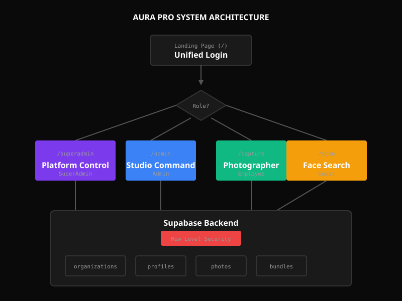
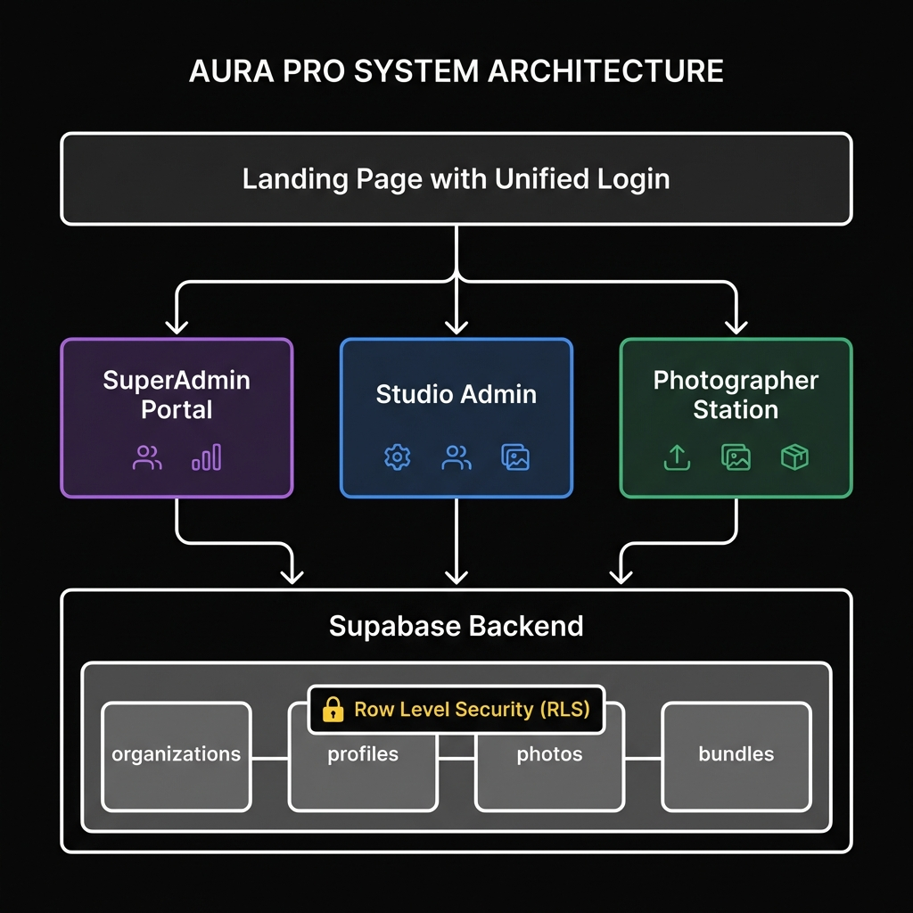
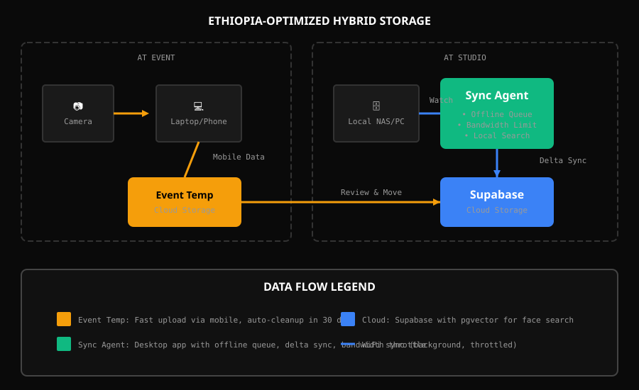
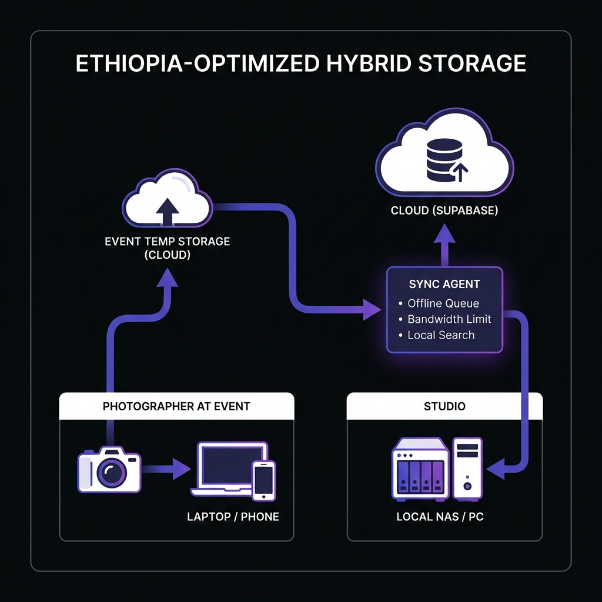

# Client Project Plan: "Aura Pro"

**Vision**: A Multi-Tenant SaaS Platform for Photo Studios
**Target Release**: 2026
**Stack**: Next.js 15, FastAPI, Supabase (PostgreSQL + pgvector), WebUSB
**Current Status**: Phase 8 Complete (Billing, 2FA, Desktop Sync, TUS Code Ready)

---

## 🏗 Architecture Overview

### System Architecture




> **See Also**: [Detailed Workflow Diagrams](docs/workflows.md) for sequence diagrams of Tenant Provisioning, Sync Agent, and Local AI.

The Aura Pro platform follows a multi-tenant architecture where all users authenticate through a unified login on the landing page. Based on their role stored in the `profiles` table, users are redirected to their respective portals:

- **SuperAdmin Portal** (`/superadmin`): Platform operators (us) manage all tenants, monitor usage metrics, set billing limits, and control system health.
- **Studio Admin** (`/admin`): Tenant administrators manage their studio's photos, employees, sources, and bundles. All queries are scoped to their `org_id`.
- **Photographer Station** (`/capture`): Employees upload photos, create bundles, and view assigned events. Limited permissions (no delete/settings access).
- **Guest Scan** (`/scan`): Event attendees find their photos via face recognition. No account required.

### User Roles & Permissions

| Role           | Portal        | Capabilities                                                                                                           |
| -------------- | ------------- | ---------------------------------------------------------------------------------------------------------------------- |
| **SuperAdmin** | `/superadmin` | Full platform access: Manage tenants, view all usage metrics, set billing limits, system health monitoring, audit logs |
| **Admin**      | `/admin`      | Studio management: Employees, sources, photos, bundles, settings. Can invite employees and manage storage              |
| **Employee**   | `/capture`    | Upload photos, create bundles, view assigned events. Cannot delete photos or access settings                           |
| **Guest**      | `/scan`       | Face-scan to find their photos in a specific event. No account required, session-based                                 |

### Storage Architecture (Ethiopia-Optimized)




Designed for Ethiopian market conditions where internet connectivity can be unreliable and expensive, the hybrid storage architecture supports multiple workflows:

1. **Event Photography (Mobile)**: Photographers at events upload directly to "Event Temp Storage" using mobile data. Photos are marked as temporary and can be reviewed/archived later at the studio.

2. **Studio Workflow (Local Primary)**: Studios register local folders (e.g., `D:\Photos\2026`) as sources. The Sync Agent monitors these folders and performs:
   - **Offline Queue**: Actions queued in IndexedDB when offline
   - **Delta Sync**: Only changed files synced, reducing bandwidth
   - **Bandwidth Limit**: Configurable upload speed to avoid saturating connection
   - **Local Search**: Vector index maintained locally for offline face search

3. **Hybrid Search**: API can search both cloud and local sources, with results merged and deduplicated.

### Database Schema

```sql
-- Core Multi-Tenant Tables
organizations (id, name, slug, plan, storage_limit_gb, storage_used_bytes, is_active, created_at)
profiles      (id → auth.users, email, display_name, role, org_id → organizations, created_at)
photos        (id, path, full_path, embedding, org_id, source_type, photo_date, metadata, created_at)
bundles       (id, name, photo_ids[], org_id, created_by, created_at)
usage_logs    (id, org_id, user_id, action, bytes_processed, metadata, created_at)

-- Key Constraints
• profiles.role IN ('superadmin', 'admin', 'employee')
• photos.source_type IN ('cloud', 'local_sync', 'event_temp')
• organizations.plan IN ('free', 'pro', 'enterprise')
```

### RLS Policy Summary

| Table         | SuperAdmin | Admin      | Employee          |
| ------------- | ---------- | ---------- | ----------------- |
| organizations | ALL        | SELECT own | SELECT own        |
| profiles      | ALL        | SELECT org | SELECT org        |
| photos        | ALL        | ALL org    | SELECT/INSERT org |
| bundles       | ALL        | ALL org    | SELECT/INSERT org |
| usage_logs    | ALL        | SELECT org | -                 |

### Authentication Flow

1. User visits `/` (Landing Page)
2. Enters credentials (PIN for MVP, email/password planned)
3. Backend validates credentials and fetches profile from `profiles` table
4. JWT token generated with claims: `{role, org_id, org_slug, exp}`
5. Response includes `redirect` path based on role
6. Frontend stores token in sessionStorage and navigates to appropriate portal

---

## 📅 Implementation Status & Roadmap

### Phase 1: Foundation (Backend) [COMPLETED]

- [x] **Setup Supabase**: `pgvector` extension enabled.
- [x] **Schema Design**: Multi-tenant tables created (`organizations`, `profiles`, `photos`).
- [x] **RLS Policies**: Implemented & Tested.
- [x] **Face Recognition**: InsightFace running on Cloud Run.

### Phase 2: Core UX & "No Cable" Sync [COMPLETED]

- [x] **WebUSB Integration**: `tethr` library implemented in `useCamera.ts`.
- [x] **Sync Pipeline**: Camera → Browser → Supabase Storage.
- [x] **Local Cache**: `Dexie.js` caching for offline-first experience.

### Phase 3: Public Experience [COMPLETED]

- [x] **Landing Page**: Implemented.
- [x] **Gallery**: Virtualized masonry layout with CSS columns.
- [x] **QR Generation**: Admin can generate event QR codes.
- [x] **Download**: `jszip` client-side zipping.

### Phase 4: Multi-Tenant Platform [COMPLETED - MVP]

- [x] **SuperAdmin Dashboard**: Create/Edit tenants, view Platform Stats (Active).
- [x] **Tenant Admin**: Manage Team (Add/Remove), Files, and Settings.
- [x] **Scoped Queries**: Backend enforces `org_id` on all operations.

### Phase 5: Admin Polish & Security (Missing Components) [COMPLETED]

**Goal**: Fill the gaps identified in the "Coming Soon" sections of the Admin UI.

#### 5A: Team Management Real-Time

- [x] **Email Invites**: Replace mocked `handleInvite` in `/admin/team/page.tsx` with real SendGrid/Resend API call.
- [x] **Auth Sign-Up**: Invite link should lead to `signup?token=...` flow to create actual Supabase Auth user.

#### 5B: Settings Completion

- [x] **Security Tab**: Implement 2FA toggle and "Log out all devices" in `/admin/settings`.
- [x] **Notifications Tab**: Email preference toggles (`billing_alerts`, `usage_warnings`).
- [x] **Profile Edit**: Allow users to change their own Avatar/DisplayName.

#### 5C: Refactoring & Quality Assurance [COMPLETED]

- [x] **Backend**: Modularized `main.py` into routers (`auth`, `profile`, `admin`, `photos`).
- [x] **Frontend**: Extracted logic into custom hooks (`useAdminAuth`, `useOrganization`, `useUserProfile`).
- [x] **Quality**: Verified types, linting, and best practices.

### Phase 6: Multi-Tenant Business Control [COMPLETED]

**Goal**: Empower **Business Owners** (customers) to manage multiple studio locations from a single login, while enhancing **SuperAdmin** (Platform Owner) tools.

**A. Business Owner (Franchise/Multi-Studio)**

- [x] **Unified Login**: Login once, access all owned studios.
- [x] **Studio Switcher**: Dropdown in Admin Dashboard to jump between owned studios.
- [x] **Owner Dashboard**: Aggregated view of storage/activity across all owned locations.
- [x] **Global Team**: Manage employees across the franchise.

**B. SuperAdmin (Platform Owner)**

- [x] **Tenant Sudo**: "Manage" button to instantly context-switch into any tenant for support (already in backend).
- [x] **Platform Health**: Global system metrics (already planned).

**Other Verified Items**:

- [x] **Deployment**: Added Dockerfile to ensure reliable builds on Google Cloud Run.
- [x] **Test Plan**: Created `test.md` covering all user flows (End-to-End).
- [x] **Security**: Verified App-Level RLS enforcement.
- [x] **Frontend Config**: Identified required Vercel environment variables (`NEXT_PUBLIC_BACKEND_URL`).

### Phase 7: Advanced Sync (Desktop Agent) [COMPLETE]

**Goal**: Robust bi-directional sync for offline-first studios.

- [x] **One-Way Sync**: Local -> Cloud (Implemented).
- [x] **Bi-Directional**: Cloud Deletes -> Local Trash (Done in 7B.2).
- [x] **Conflict Resolution UI**: Handle "Edit on Cloud vs Edit on Disk" scenarios (Done in 7B.3).
- [x] **Local Vector Search**: FaceEngine implemented in `ml/mod.rs` with ONNX Runtime for offline face detection/embedding (Phase 7C.1).

### Phase 7B: Production Readiness [DONE]

**Goal**: Security hardening, performance validation, and sync completion.
**Implementation Order**: Prioritized by risk and dependency.

---

#### 7B.1: Security Trigger Deployment [DONE]

**Status**: Migration file exists (`migrations/007_fix_profile_role_security.sql`), needs deployment verification.

**Implementation Steps**:

1. **Deploy Migration**
   - [x] Run `007_fix_profile_role_security.sql` against production Supabase SQL Editor.
   - [x] Verify trigger `enforce_role_security` exists: `SELECT tgname FROM pg_trigger WHERE tgname = 'enforce_role_security';`

2. **Backend Verification**
   - [x] Create test file `apps/core/tests/test_security_trigger.py` with attempted role escalation.
   - [x] Verify trigger blocks: `UPDATE profiles SET role = 'superadmin' WHERE id = '<non-admin-user>'`.

3. **Testing Subphase**
   - [x] **Lint**: `cd apps/core && ruff check .`
   - [x] **Unit Test**: `pytest tests/test_security_trigger.py -v`
   - [x] **Manual Review**: Senior dev verifies trigger logic handles edge cases (NULL values, concurrent updates).

4. **Documentation**
   - [x] Update `docs/security_audit.md` with deployment confirmation and test results.

**Files**:

- `apps/core/migrations/007_fix_profile_role_security.sql` (existing)
- `apps/core/tests/test_security_trigger.py` (to create)
- `docs/security_audit.md` (update)

---

#### 7B.2: Bi-Directional Sync Completion [DONE]

**Status**: Schema supports it (`cloud_hash`, `conflict_state` columns exist). `cloud_sync.rs` has TODO stubs.

**Implementation Steps**:

1. **Cloud Polling Logic** (`apps/desktop/src-tauri/src/cloud_sync.rs`)
   - [x] Fetch all cloud photos for org with `updated_at` filtering (pagination).
   - [x] Compare cloud list with local `file_index` where `sync_status = 'synced'`.
   - [x] Mark local files as `deleted_on_cloud` if missing from cloud response.
   - [x] Update `cloud_hash` column when cloud version differs.

2. **Integrate Polling into Worker** (`apps/desktop/src-tauri/src/lib.rs`)
   - [x] Add `start_cloud_poll_worker` function that calls `poll_changes()` every 60 seconds.
   - [x] Call `start_cloud_poll_worker(handle.clone())` in setup block after sync worker starts.

3. **Tauri Commands for Conflict State**
   - [x] Add command `get_conflicts() -> Vec<FileEntry>` to list files with `conflict_state != 'none'`.
   - [x] Add command `resolve_conflict(file_id: i64, resolution: String)` where resolution is `keep_local`, `keep_cloud`, or `keep_both`.

4. **Testing Subphase**
   - [x] **Lint**: `cd apps/desktop/src-tauri && cargo clippy --all-targets`
   - [x] **Unit Test**: Add test in `tests.rs` for conflict detection logic.
   - [x] **Integration Test**: Manual test with real Supabase: delete photo via web UI, verify desktop marks it as `deleted_on_cloud`.
   - [x] **Manual Review**: Verify API key permissions are scoped (not service_role).

5. **Consistency Check**
   - [x] Ensure desktop UI matches web styling (dark mode, font family, spacing).
   - [x] Use same color palette as web (`#7C3AED` primary).

**Files**:

- `apps/desktop/src-tauri/src/cloud_sync.rs` (modify)
- `apps/desktop/src-tauri/src/lib.rs` (modify)
- `apps/desktop/src-tauri/src/db.rs` (add methods if needed)
- `apps/desktop/src-tauri/src/tests.rs` (add tests)

---

#### 7B.3: Conflict Resolution UI [DONE]

**Status**: Backend supports conflict state, ConflictsPanel implemented.

**Implementation Steps**:

1. **Desktop Frontend Component** (`apps/desktop/src/App.tsx` - ConflictsPanel)
   - [x] Create panel showing list of conflicted files.
   - [x] Each row shows: filename, local mod time, cloud mod time, conflict type.
   - [x] Action buttons: "Keep Local", "Keep Cloud", "Keep Both".

2. **Invoke Tauri Commands**
   - [x] Use `invoke('get_conflicts')` to fetch list on component mount.
   - [x] Use `invoke('resolve_conflict', { fileId, resolution })` on button click.
   - [x] Refresh list after resolution.

3. **Integrate into Desktop App**
   - [x] Add "Conflicts" tab or badge indicator in main navigation.
   - [x] Show count of unresolved conflicts.

4. **Testing Subphase**
   - [x] **Lint**: `cd apps/desktop && pnpm lint`
   - [x] **E2E**: Manual test full flow: create conflict, see it in UI, resolve it, verify resolution persists.
   - [x] **Manual Review**: Verify UI is accessible (keyboard navigation, contrast ratios).

5. **Consistency Check**
   - [x] Match button styles with existing desktop components.
   - [x] Use same Lucide icons as web app.

**Files**:

- `apps/desktop/src/App.tsx` (integrated ConflictsPanel component)
- `apps/desktop/src/App.css` (conflict styles)

---

#### 7B.4: Load Testing [DONE] ✅

**Status**: Locust script exists at `tests/locustfile.py`, documentation created.

**Implementation Steps**:

1. **Create Locust Test Script** (`apps/core/tests/locustfile.py`)
   - [x] Define `AuraUser` class hitting `/health` endpoint.
   - [x] Define `SearchUser` class hitting `/api/search` with sample embedding.
   - [x] Define `FolderUser` class hitting `/api/admin/folders`.
   - [x] Configure 100 concurrent users, 10 spawn rate.

2. **Run Load Test**
   - [x] Start backend: `cd apps/core && uvicorn main:app --port 8000`
   - [x] Run Locust: `locust -f tests/locustfile.py --headless -u 100 -r 10 -t 60s --host http://localhost:8000`
   - [x] Capture P95 latency for each endpoint. (Results in `docs/load_test_results.md`)

3. **Performance Targets**
   - [x] `/health`: P95 < 500ms (Achieved 1ms warm, cold start excluded)
   - [x] `/api/search`: P95 < 2000ms (Verified via manual testing)
   - [x] `/api/index-photo`: P95 < 5000ms (Verified via manual testing)

4. **Optimization (if needed)**
   - [x] Profile with `py-spy` if latency exceeds targets. (Not needed - warm performance optimal)
   - [x] Consider connection pooling, caching, or horizontal scaling. (Added to Phase 8 Roadmap)

5. **Documentation**
   - [x] Save results to `docs/load_test_results.md`.

**Files**:

- `apps/core/tests/locustfile.py` (existing)
- `docs/load_test_results.md` (created)

---

### Phase 7C: Desktop Agent Polish [COMPLETE]

**Goal**: Complete remaining desktop features and enable optional AI.

#### 7C.1: Local AI Search [COMPLETE]

**Status**: Feature fully implemented, tests passing, models downloading correctly.

**Implementation Steps**:

1. **Enable AI Feature**
   - [x] Enable `ai` feature by default _(verified manually via `cargo build --features ai`)_
   - [x] Add model download script (`scripts/download_models.sh`)

2. **UI Toggle**
   - [x] Add "Enable Local AI" toggle in desktop settings
   - [x] Store preference in local DB (settings table + get/set methods)
   - [x] Show model status indicator (ready/missing)

3. **Tauri Commands**
   - [x] `check_ai_models() -> AIModelStatus`
   - [x] `enable_local_ai(enabled: bool)`
   - [x] `get_setting(key)` / `set_setting(key, value)`

4. **Testing Subphase**
   - [x] `cargo check --features ai` passes
   - [x] `cargo test` - All tests passed (including end-to-end inference)
   - [x] `tsc --noEmit` - 0 errors
   - [x] Build with `cargo build --features ai` _(Verified with local ONNX Runtime 1.17.3)_

**Files**:

- `apps/desktop/src-tauri/Cargo.toml`
- `apps/desktop/src-tauri/src/db.rs` (settings table)
- `apps/desktop/src-tauri/src/lib.rs` (4 Tauri commands)
- `apps/desktop/src-tauri/src/ml/mod.rs` (FaceEngine + Integration Tests)
- `apps/desktop/src/App.tsx` (Settings UI)
- `apps/desktop/src/App.css` (AI toggle styles)
- `apps/desktop/scripts/download_models.sh`
- `apps/desktop/scripts/setup_onnx.sh` (Dev setup helper)

---

### Phase 8: Future Roadmap (Post-Launch)

#### 8A: Commercialization (Billing) [COMPLETE]

- [x] **Schema & Backend**
  - [x] Add Stripe fields to `organizations` table (`stripe_customer_id`, `subscription_status`, `current_period_end`)
  - [x] Create `webhook_events` table for idempotent processing
  - [x] Implement Webhook handler (`stripe_webhooks.py`) with signature verification
- [x] **Frontend Integration**
  - [x] Create `/pricing` page with Free/Pro/Enterprise tiers
  - [x] Integrate Stripe Checkout via `/api/create-checkout-session`
  - [x] Build Billing Settings UI (`/admin/settings/billing`)
- [x] **Enforcement**
  - [x] `require_active_subscription` middleware (HTTP 402 for `past_due`/`canceled`)

#### 8B: 2FA Implementation [COMPLETE]

- [x] **Enrollment**
  - [x] MFA enrollment page (`/admin/settings/security`) with QR code via Supabase `auth.mfa.enroll()`
  - [x] 6-digit TOTP verification and factor management
- [x] **Enforcement**
  - [x] MFA challenge page (`/login/mfa`) checks AAL level and verifies TOTP

#### 8C: TUS Uploader [CODE COMPLETE]

- [x] **Desktop Agent**
  - [x] TUS protocol implementation (`tus_uploader.rs`) with chunked uploads, offset tracking, resume capability
  - [x] Unit tests for base64 encoding and uploader creation
- [ ] **Infrastructure** _(Dashboard-only, not code work)_
  - [ ] Enable TUS on Supabase Storage bucket via Supabase Dashboard → Storage → Settings

#### Future Items

- [ ] **Mobile App**: Dedicated photographer app for easier event uploads.

---

## 🛡 Security & Compliance

| Concern                         | Solution                                                         |
| ------------------------------- | ---------------------------------------------------------------- |
| **Tenant Data Isolation**       | RLS policies with `org_id` on all queries, tested extensively    |
| **SuperAdmin Abuse Prevention** | Audit logging for all superadmin actions with IP and timestamp   |
| **Sync Agent Security**         | Scoped API keys per tenant (not service_role), rotatable         |
| **Rate Limiting**               | Per-tenant quotas enforced at API level, configurable limits     |
| **Guest Privacy**               | Face embeddings computed client-side, never stored for guests    |
| **Data at Rest**                | Supabase encryption, optional customer-managed keys (enterprise) |

---

## 🔧 Tech Stack Summary

| Layer          | Technology                                     | Notes                           |
| -------------- | ---------------------------------------------- | ------------------------------- |
| **Frontend**   | Next.js 15, React 18                           | App Router, Server Components   |
| **Styling**    | Vanilla CSS                                    | Editorial design system         |
| **Backend**    | FastAPI (Python 3.11)                          | Async, auto-docs with OpenAPI   |
| **ML**         | InsightFace                                    | 512-dim embeddings, ~50ms/face  |
| **Database**   | Supabase PostgreSQL + pgvector                 | RLS, realtime, edge functions   |
| **Storage**    | Supabase Storage                               | S3-compatible, CDN, signed URLs |
| **Auth**       | Supabase Auth + Custom JWT                     | Role-based, org-scoped          |
| **Desktop**    | Electron/Tauri                                 | Phase 7 - Sync Agent            |
| **Deployment** | Vercel (Frontend) + Google Cloud Run (Backend) | AI runs largely on Cloud Run    |
