# Client Project Plan: "Aura Pro"

**Vision**: A Multi-Tenant SaaS Platform for Photo Studios  
**Target Release**: 2026  
**Stack**: Next.js 15, FastAPI, Supabase (PostgreSQL + pgvector), WebUSB

---

## 🏗 Architecture Overview

### System Architecture


The Aura Pro platform follows a multi-tenant architecture where all users authenticate through a unified login on the landing page. Based on their role stored in the `profiles` table, users are redirected to their respective portals:

- **SuperAdmin Portal** (`/superadmin`): Platform operators manage all tenants, monitor usage metrics, and control billing.
- **Studio Admin** (`/admin`): Tenant administrators manage their studio's photos, employees, and bundles.
- **Photographer Station** (`/capture`): Employees upload photos and create bundles with limited permissions.
- **Guest Scan** (`/scan`): Event attendees find their photos via face recognition.

### Storage Architecture (Ethiopia-Optimized)

```mermaid
flowchart LR
    subgraph EVENT["At Event"]
        CAM[📷 Camera]
        LAP[💻 Laptop/Phone]
        TEMP[(Event Temp<br/>Cloud Storage)]
    end
    
    subgraph STUDIO["At Studio"]
        NAS[🗄️ Local NAS/PC]
        AGENT[Sync Agent]
        CLOUD[(Supabase<br/>Cloud)]
    end
    
    CAM -->|"Mobile Data"| LAP
    LAP -->|"Fast Upload"| TEMP
    
    NAS <-->|"Watch"| AGENT
    AGENT -->|"Delta Sync<br/>WiFi Only"| CLOUD
    TEMP -->|"Review & Move"| CLOUD
    
    subgraph FEATURES["Sync Agent Features"]
        F1[✓ Offline Queue]
        F2[✓ Bandwidth Limit]
        F3[✓ Local Search]
    end
    
    AGENT --- FEATURES
    
    style TEMP fill:#F59E0B,color:#000
    style CLOUD fill:#3B82F6,color:#fff
    style AGENT fill:#10B981,color:#fff
```



**Designed for Ethiopian market conditions** where internet connectivity can be unreliable:

1. **Event Photography**: Fast upload to temporary cloud storage using mobile data
2. **Studio Workflow**: Local NAS as primary, background sync when WiFi available  
3. **Hybrid Search**: API queries both cloud and local sources

### Database Schema

```sql
-- Core Multi-Tenant Tables
organizations (id, name, slug, plan, storage_limit_gb, storage_used_bytes, is_active)
profiles      (id → auth.users, email, role, org_id → organizations)
photos        (id, path, embedding[512], org_id, source_type, created_at)
bundles       (id, name, photo_ids[], org_id, created_by, created_at)
usage_logs    (id, org_id, action, bytes_processed, created_at)
```

### User Roles & Permissions

| Role | Portal | Capabilities |
|------|--------|--------------|
| **SuperAdmin** | `/superadmin` | Manage tenants, view metrics, set limits |
| **Admin** | `/admin` | Manage studio: employees, sources, photos |
| **Employee** | `/capture` | Upload photos, create bundles |
| **Guest** | `/scan` | Face search, download own photos |

### RLS Policy Matrix

| Table | SuperAdmin | Admin | Employee |
|-------|------------|-------|----------|
| organizations | ALL | SELECT own | SELECT own |
| profiles | ALL | SELECT org | SELECT org |
| photos | ALL | ALL org | SELECT/INSERT |
| bundles | ALL | ALL org | SELECT/INSERT |

---

## 📅 Implementation Phases

### Phase 1: Foundation Upgrade (Backend) [DONE]

**Goal**: Migrate from local CSV/LanceDB to cloud-native Supabase.

- [x] Setup Supabase with `pgvector` extension
- [x] Schema design for users, photos, bundles
- [x] Migrate `database.py` to use Supabase client
- [x] Implement face-login authentication API

> **Tech**: Using HNSW index for sub-100ms similarity search on 100k+ embeddings.

### Phase 2: Core UX & "No Cable" Sync [DONE]

**Goal**: Build the Admin Capture Station with direct camera connection.

- [x] WebUSB integration via `tethr` library
- [x] Sync pipeline: Camera → Browser → Supabase Storage
- [x] Dexie.js caching for instant thumbnail preview

### Phase 3: Public Face [DONE]

**Goal**: Professional landing page and guest experience.

- [x] Editorial-style landing page (bold typography, no glassmorphism)
- [x] Virtualized gallery with TanStack Virtual
- [x] QR code generation for events

### Phase 4: Intelligence & Delivery [DONE]

**Goal**: Advanced face search and download management.

- [x] Backend `match_faces` RPC with cosine similarity
- [x] Client-side zip generation via `jszip`

### Phase 5: Multi-Tenant Platform [IN PROGRESS]

**Goal**: Role-based access control and SuperAdmin management portal.

#### 5A: Database Foundation [DONE]
- [x] **Organizations Table**: Tenants with plan limits and storage tracking
- [x] **Profiles Table**: Users with roles (superadmin/admin/employee)
- [x] **RLS Policies**: Strict tenant isolation via `org_id` filtering
- [x] **Role-Based JWT**: Login returns token with role, org_id, org_slug claims
- [x] **SuperAdmin Portal**: `/superadmin` route with tenant CRUD and stats dashboard

#### 5B: SuperAdmin Portal Enhancements [TODO]
- [ ] **Usage Dashboard**: API calls per tenant, searches/day, chart visualizations
- [ ] **Billing Management**: Upgrade plans, set custom limits, overage alerts
- [ ] **Audit Logging**: Track all superadmin actions with timestamps
- [ ] **Tenant Onboarding**: Email workflow for new tenant invites

#### 5C: Tenant Admin Scoping [TODO]
- [ ] **Scoped Queries**: All `/admin` queries filtered by `org_id` from JWT
- [ ] **Employee Management**: Invite via email, assign roles, remove access
- [ ] **Usage Tracking**: Middleware to log API calls and storage usage

### Phase 6: Hybrid Storage [PLANNED]

**Goal**: Local + Cloud sources for Ethiopian market.

#### 6A: Cloud Enhancements
- [ ] `source_type` column (cloud/local_sync/event_temp)
- [ ] Sources management UI
- [ ] Event temp tier with 30-day auto-cleanup

#### 6B: Sync Agent (Desktop App)
- [ ] Electron/Tauri app for Windows/Mac
- [ ] Local folder watch + IndexedDB queue
- [ ] Delta sync with bandwidth throttle
- [ ] Local vector index for offline search

---

## 🛡 Security

| Concern | Solution |
|---------|----------|
| Tenant Data Isolation | RLS policies with `org_id` on all queries |
| SuperAdmin Abuse | Audit logging with IP and timestamp |
| Sync Agent Security | Scoped API keys, not service_role |
| Rate Limiting | Per-tenant quotas at API level |

---

## 🔧 Tech Stack

| Layer | Technology |
|-------|------------|
| Frontend | Next.js 15, React 18, Vanilla CSS |
| Backend | FastAPI (Python 3.11), InsightFace |
| Database | Supabase PostgreSQL + pgvector |
| Storage | Supabase Storage (S3-compatible) |
| Auth | Supabase Auth + Custom JWT |
| Desktop | Electron/Tauri (Phase 6) |
| Deploy | Vercel (Frontend), Cloud Run (Backend) |
