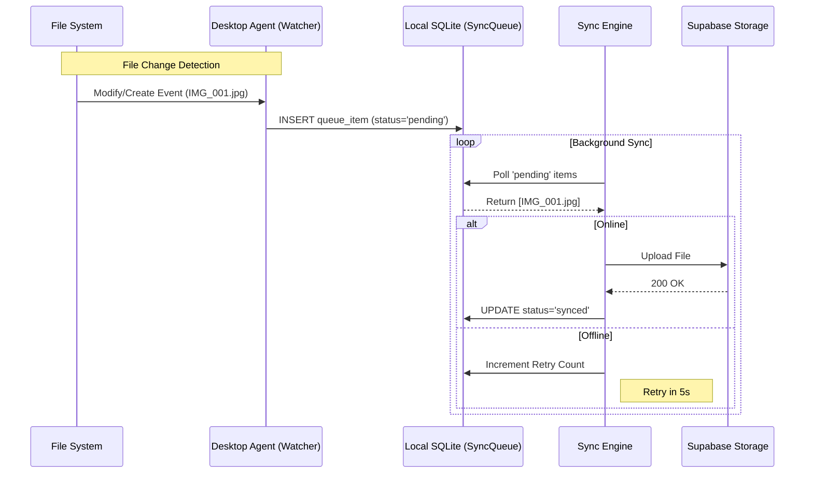

# System Workflows & Diagrams

This document visualizes the core logical flows of the Aura Pro platform using Mermaid diagrams.

## 1. Tenant Provisioning (Phase 5)

This flow describes how a SuperAdmin creates a new Organization and its primary Administrator.

```mermaid
sequenceDiagram
    actor SuperAdmin
    participant EmailDB
    participant Aura
    actor "Tenant Admin"

    SuperAdmin->>Aura: Login at /login
    Aura->>SuperAdmin: Redirect to /superadmin

    rect rgb(20, 20, 20)
        note right of SuperAdmin: Tenant Creation
        SuperAdmin->>Aura: Create New Organization
        Aura->>EmailDB: INSERT organizations

        SuperAdmin->>Aura: Create Primary Admin for Org
        Aura->>EmailDB: INSERT profiles (role=admin, org_id)

        Aura->>EmailDB: Send invite to admin@tenant.com
    end

    "Tenant Admin"->>Aura: Click Invite Link (Set Password)
    "Tenant Admin"->>Aura: Login to /admin

    rect rgb(25, 25, 35)
        note right of SuperAdmin: Ongoing Management
        SuperAdmin->>Aura: View Usage Dashboard
        note right of Aura: Storage, API calls, searches per tenant
        SuperAdmin->>Aura: Edit Tenant (Plan/Storage Limit)
        SuperAdmin->>Aura: Suspend/Activate Tenant
    end
```

## 2. Sync Agent Architecture (Phase 6B)

The Desktop Agent synchronizes local folders with the cloud using a robust "Delta Sync" and offline-queue strategy.

## 3. Local AI Pipeline (Phase 7C.1)

Face detection and recognition running entirely offline using ONNX Runtime.

```mermaid
sequenceDiagram
    participant UI as Tauri Frontend
    participant Rust as Rust Backend (FaceEngine)
    participant ONNX as ONNX Runtime (C++ Lib)

    UI->>Rust: check_ai_models()
    Rust->>ONNX: Verify .onnx files exist
    Rust-->>UI: { status: "ready" }

    UI->>Rust: detect_faces(image_path)

    rect rgb(30, 40, 50)
        note right of Rust: Inference Pipeline
        Rust->>Rust: Preprocess (Resize 640x640, Normalize)
        Rust->>ONNX: Run Session (SCRFD Model)
        ONNX-->>Rust: Raw Tensors (Scores, BBox)
        Rust->>Rust: Post-process (NMS, Threshold)

        loop For Each Face
            Rust->>Rust: Crop & Align (112x112)
            Rust->>ONNX: Run Session (ArcFace Model)
            ONNX-->>Rust: Embedding (512-d Vector)
        end
    end

    Rust-->>UI: Returns [Faces, Embeddings]
```

